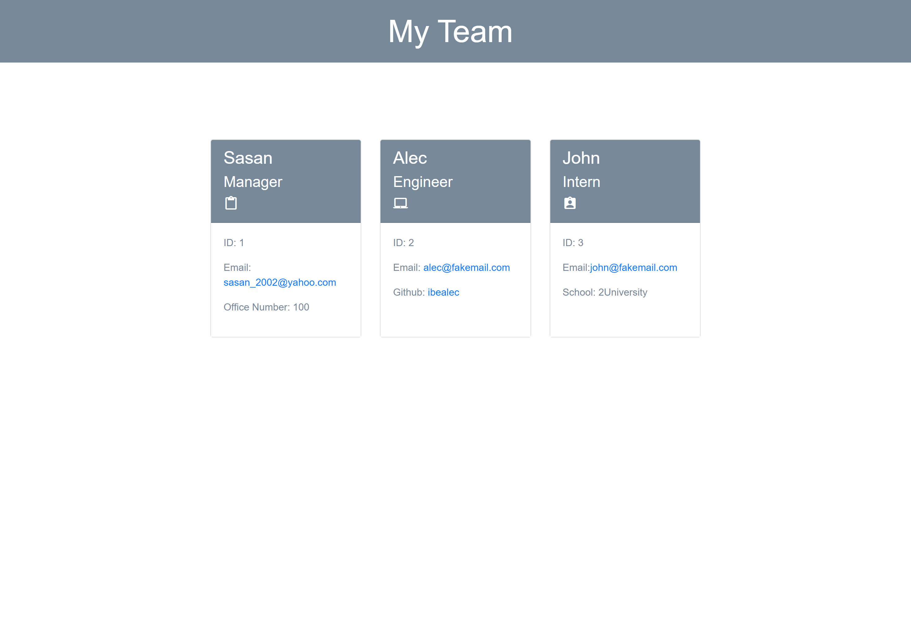

# Team Profile Generator
  
  ## Table of Contents:
  1. [Description](#Description) 
  2. [Installation](#Installation)
  3. [Usage](#Usage)  
  4. [Contributing](#Contributing)
  5. [Tests](#Tests)
  6. [License](#License)
  7. [Questions](#Questions)
  
## Description
This application was created to generate a team profile based on user input using the Inquirer module from Node.js and displaying the information on a newly created html page with a style sheet. This project demonstrates use of OOP and TDD using Jest. 
## Installation
The user should clone the repository from GitHub and download Node. This application also requires a file system and inquirer module. If testing is required, this application uses Jest.
## Usage
Use inquirer from your command line to answer questions about your project. View walk through video here [DEMO Video](https://drive.google.com/file/d/1DyksP-IeH2sVtjWY2qmaYBKSn21MMutn/view?usp=sharing)

## Contributing
Contributors should read the installation section.
## Tests
Run npm test to run Jest for tests on constructors.
## License
[MIT License](https://opensource.org/licenses/MIT)
## Questions
You can contact me at my Email: sasan_2002@yahoo.com

Link to my Github profile: [sasansinson](https://github.com/sasansinson)